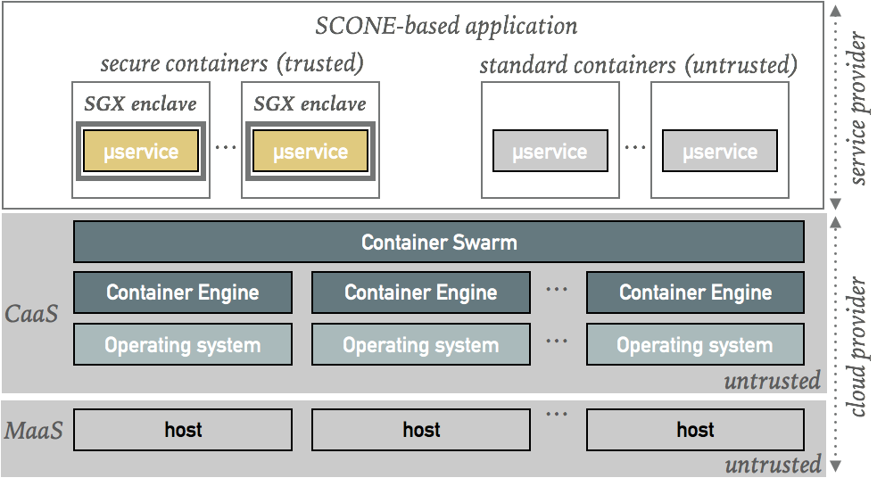

# Welcome to SCONE

SCONE is a platform to **build and run secure containers**. Secure containers protect the confidentiality and integrity 
of containers by runing services inside Intel SGX enclaves. For example, we protect services against nosy administrators and hackers with root access that could otherwise just dump the main memory content or configuration files of services to get access to keys stored there. 

The secure containers are compatible with Docker containers. SCONE uses Docker Swarm to run and orchestrate 
applications consisting of multiple containers running across multiple hosts. 
We plan to support other container services - like Kubernetes and Ranger - at some later time.

## Application-Oriented Security

SCONE supports DevOps to protect the confidentiality and integrity of application even when running in clouds that
cannot be (completely) trusted. Our approach is to encrypt - by default - all network communication, all files and all 
processing (by running inside of enclaves). To reduce the required resources, we support an opt-out approach that
permits to drop certain protections. For example, a service that operates only on encrypted data might not need to be protected with SGX. 

## Ease of Use

SCONE supports strong application-oriented security with a workflow like Docker, i.e., 
SCONE supports [Dockerfiles](SCONE_Dockerfile.md) as well as extended Docker *stack* files. This simplifies the construction and operation of applications consisting of a set of containers. This fits in particular modern cloud-native applications consisting of  microservices and each microservice runs either in a standard or a secure container.

## Documentation

* [SCONE Background](background.md): we give a short introduction regarding the objectives and the problems addressed by SCONE.

* [SCONE Host Setup](SCONE_HOSTINSTALLER_README.md): to run secure containers, 
we need to configure each host to run a Linux SGX driver and also a (for convenience, a patched) Docker engine. 

* [SCONE SGX Toolchain](SCONE_COMPILER_CONTAINER_README.md): SCONE supports cross-compilers (C, C++, more to come soon) to compile and build 
applications for SGX enclaves.  

* [SCONE Curated Container Images](SCONE_Curated_Images.md): we will support a set of secure container images to simplify the use of  

* [SCONE Tutorial](SCONE_TUTORIAL.md): we show how to compile simple example applications with the help of the SCONE SGX Toolchain.

* [SCONE Dockerfile](SCONE_Dockerfile.md): we support the use of Dockerfiles to generate Docker images that contain services running inside of SGX enclaves (this requires a [patched Docker Engine](SCONE_HOSTINSTALLER_README.md)).

* [Publications](SCONE_Publications.md):  some of the technical aspects of SCONE have been published in scientific papers. 
We provide a short summary of the papers and links to the pdfs. 

Author: Christof Fetzer, 2017
